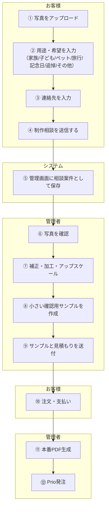
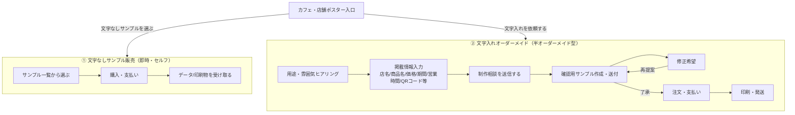
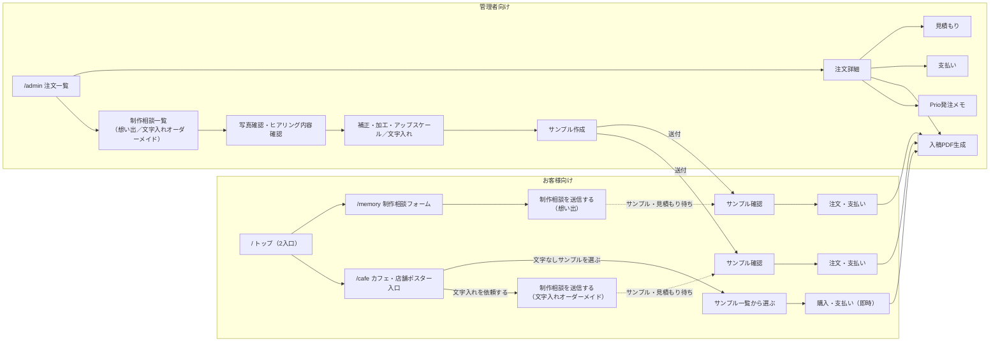

# v1.3 新設計書 — Hana Poster AI 画面再設計

**ステータス**: 設計のみ（未実装）
**ベース**: v1.2-rc2（`#memorySection` 追加は v1.3-rc1 で実装済み）
**対象**: `static/index.html` / `static/app.js` / `main.py` の画面構成

> このドキュメントは設計書であり、実装は含まない。v1.3 の実装に着手する際の起点として使う。

**改訂**: v1.3-rc1 タグ後、想い出ポスターの提供形態を「即時セルフ注文型」から「半オーダーメイド型（制作相談 → サンプル確認 → 注文）」に修正。詳細は [4.1](#41-想い出ポスターフロー半オーダーメイド型) を参照。

---

## 1. サービスコンセプト

Hana Poster AI を「花屋さん向けの1画面アプリ」から、「想い出ポスター」「カフェ・店舗ポスター」の
2本のウィザード型フローを持つポスター作成サービスへ作り直す。

- 提供形態は3系統に分かれる。想い出ポスターは写真確認・補正・サンプル提示を人手で挟む**半オーダーメイド型**（詳細は[4.1](#41-想い出ポスターフロー半オーダーメイド型)）。カフェ・店舗ポスターはさらに、完成デザインをその場で購入する**文字なしサンプル販売（即時・セルフ）**と、店名・価格等を入れて仕上げる**文字入れオーダーメイド（半オーダーメイド型）**の2つに分かれる（詳細は[4.2](#42-カフェ・店舗ポスターフロー2系統文字なしサンプル販売--文字入れオーダーメイド)）
- 花・ギフト素材は独立カテゴリではなく、カフェ・店舗ポスターの「文字なしサンプル販売」に含まれる素材の一つとして存在する
- 管理業務（見積もり・支払い・入稿・Prio発注、および想い出ポスター／文字入れオーダーメイドの制作相談対応）はお客様の目に触れない管理画面に完全分離する

---

## 2. 現行UIの問題点（洗い出し）

| # | 問題 | 現状の該当箇所 |
|---|---|---|
| 1 | 機能が1画面に混在している | `index.html` が花図鑑・AI販促文・ギャラリー・文字入れ・注文履歴・管理操作をすべて1ページに縦積みしている |
| 2 | お客様向けと管理者向けが混ざっている | `#confirmationSection` の「開発用操作」に管理者用PDF/PNG生成が置かれ、`#serverOrdersSection` の管理操作もお客様と同じページ内にスクロールで存在 |
| 3 | PDF保存と仮注文の意味が分かりにくい | 「PNGで保存」「PDFで保存」ボタンと「この内容で仮注文する」ボタンが同じ画面にあり、どちらが注文になるのか都度注記が必要になっている（`order-flow-notice` が複数箇所に重複） |
| 4 | 花素材が前面に出すぎている | ヒーロー直下の作例エリア・ギャラリーが花7カテゴリ（春/夏/秋/冬/母の日/ギフト/開店祝い）中心の構成のまま |
| 5 | 想い出ポスターの導線が弱い | 「自分の画像を使う」アップロードは詳細設定の中に埋もれており（`#advancedSettingsDetails` 内）、高画質化・補正の機能自体が存在しない |
| 6 | カフェ向けのヒアリングがない | `#wishSection`（希望を伝えるフォーム）は用途チップはあるが花・ポスター前提の選択肢のみで、カフェのメニュー・イベント告知などを想定した項目がない |
| 7 | （追加）入口と実フローが分断している | v1.2-rc2 で追加した入口カード（`#entryMemoryCard` / `#entryCafeCard`）はクリック後に既存の汎用編集画面へスクロールするだけで、カテゴリ専用のヒアリングや補正ステップに接続されていない |

---

## 3. 設計方針：お客様向け画面と管理画面の分離

現在は `main.py` の `GET /` が `index.html` 一枚を返し、注文管理UIも同じページ内に同居している。
v1.3 では画面を役割単位で明確に分け、URLレベルでも分離する。

| 領域 | 想定ルート | できること |
|---|---|---|
| お客様向け | `/`（トップ） → `/memory`（想い出＝制作相談フォーム） → `/cafe`（カフェ・店舗入口。文字なしサンプル販売／文字入れオーダーメイドに分岐） | 想い出：写真アップロード／制作相談を送る／（後日）サンプル確認・注文。カフェ・店舗の文字なしサンプル：選ぶ／購入・支払い（即時）。カフェ・店舗の文字入れオーダーメイド：ヒアリング／制作相談を送る／（後日）サンプル確認・注文 |
| 管理者向け | `/admin`（注文一覧・詳細） | 注文を見る／見積もり／支払い／入稿PDF生成／Prio発注／（想い出・文字入れオーダーメイド）制作相談対応・写真確認・補正・文字入れ・サンプル送付 |

- お客様向け画面には管理操作（PDF/PNG生成ボタン、見積もり編集、支払いステータス変更など）を一切表示しない
- 管理画面には花図鑑・AI販促文などお客様向け機能を表示しない
- `/admin` の注文一覧は、文字なしサンプル販売の即時購入と、想い出ポスター／文字入れオーダーメイドの制作相談案件を区別できるようにする（一覧を分けるか、種別・ステータスで絞り込めるようにするかは実装時に決定）
- バックエンドAPI（`/api/orders/*` 系）は現状のものをほぼそのまま流用し、フロントのルーティングのみ分離する

---

## 4. 2本の主力フロー

### 4.1 想い出ポスターフロー（半オーダーメイド型）

**目的**: 写真をアップロードしてもらい、こちらで写真確認・補正・加工・アップスケールを行った上で確認用サンプルを提示し、お客様の合意を得てから注文・支払いへ進む。

> **重要**: 最初の送信は「注文」ではなく「制作相談」。この時点では決済・印刷・発送は発生しない。決済が発生するのは、サンプルと見積もりを確認したお客様が「注文・支払い」に進んだ時点から。

| # | ステップ | 主体 | 内容 | 現行UIとの対応 |
|---|---|---|---|---|
| 1 | 写真をアップロード | お客様 | 端末から写真を選択。図鑑参考用画像は不可（権利チェックを継続） | `#memorySection` の `#memoryPhotoInput`（v1.3-rc1で実装済みのプレビュー機能）を流用 |
| 2 | 用途・希望を入力 | お客様 | 家族／子ども／ペット／旅行／記念日／追悼／その他 から選択 | 新規。`#wishSection` の chip UI パターンを流用 |
| 3 | 連絡先を入力 | お客様 | 氏名・メールアドレス・電話番号など、相談の連絡先 | `#customer-info-section` の該当項目（氏名・メール・電話）を流用 |
| 4 | 「制作相談を送信する」 | お客様 | 送信ボタン。この時点では決済・印刷・発送は発生しない | 新規。既存 `/api/save-order` を流用しつつ、種別（相談／即時注文）を区別できるフィールドを追加する想定（[7章](#7-既存機能の再利用方針)参照） |
| 5 | 相談案件として保存 | システム | ステータス「相談受付」で管理画面に登録 | `#serverOrdersSection` 相当の一覧表示ロジックを流用 |
| 6 | 写真を確認 | 管理者 | アップロードされた写真の状態を確認 | `/admin` 注文（相談）詳細画面。ステータスを「写真確認中」に更新 |
| 7 | 補正・加工・アップスケール | 管理者 | 明るさ・コントラスト補正、必要に応じたアップスケール | **新規機能**（現行に該当なし。手動作業か半自動処理かは[10章](#10-非対象・保留事項)で未決定）。ステータスを「サンプル作成中」に更新 |
| 8 | 小さい確認用サンプルを作成 | 管理者 | 決定前に見せる縮小版サンプル画像を生成 | 新規。既存の高解像度PDF/PNG生成ロジック（`/api/orders/{id}/pdf` 等）を縮小出力に転用できる可能性がある |
| 9 | お客様へサンプルと見積もりを送る | 管理者 | サンプル画像＋見積もりをお客様に送付。ステータスを「サンプル確認待ち」→送付後「見積もり送付済み」に更新 | `/api/orders/{id}/estimate` を流用。送付手段（メール／お客様向けページ表示等）は本設計書では未決定 |
| 10 | お客様が注文・支払い | お客様 | サンプルと見積もりに合意し、正式注文・決済に進む。ステータスを「注文確定」に更新 | `/api/orders/{id}/payment` を流用 |
| 11 | 本番PDF生成 | 管理者 | 入稿用PDFを生成 | `/api/orders/{id}/pdf` を流用（無変更） |
| 12 | Prio発注 | 管理者 | Prioへ発注。ステータスを「発注済み」→完了後「完了」に更新 | `/api/orders/{id}/submission-check` 等を流用（無変更） |

#### UI文言の変更（想い出ポスターのみ。カフェ・店舗ポスターは「仮注文」文言のまま変更しない）

| 変更前 | 変更後 |
|---|---|
| 「この内容で仮注文する」 | 「制作相談を送信する」 |
| 「仮注文を受け付けました」 | 「制作相談を受け付けました」 |
| （なし） | 「内容を確認後、見積もり・お支払い案内をお送りします」 |
| （なし） | 「写真確認・補正作業のため、返信までお時間をいただく場合があります」 |

#### 制作相談ステータス（想い出ポスター専用）

想い出ポスターの相談案件は、カフェ・店舗の即時仮注文とは別のステータス系列で管理する。

`相談受付 → 写真確認中 → サンプル作成中 → サンプル確認待ち → 見積もり送付済み → 注文確定 → 入金待ち → 入金済み → 発注済み → 完了`

- 現行の注文ステータス（`new` / `checking` / `ready` / `done` / `canceled`）および支払いステータス（未請求／請求済み／入金待ち／入金済み／返金／キャンセル）はカフェ・店舗の即時仮注文向けの粒度であり、想い出ポスターの相談〜サンプル〜注文という多段階の流れをそのまま表現できない
- 想い出ポスター用に上記10段階のステータスを新設するか、既存の `status` フィールドを拡張するかは実装時に決定する（[10章](#10-非対象・保留事項)参照）

### 4.2 カフェ・店舗ポスターフロー（2系統：文字なしサンプル販売 / 文字入れオーダーメイド）

**目的**: カフェ・店舗ポスターは提供形態が異なる2系統に分ける。「今すぐ使える」ニーズと「お店専用に仕上げたい」ニーズを1本のセルフ注文フローに無理に統合しない。

> **重要**: 文字なしサンプル販売では、基本的に文字入れはしない。店名・商品名・価格・期間などの文字入れが必要な場合は、文字入れオーダーメイド（半オーダーメイド型）として扱う。

#### 入口の分岐

**UI文言案**

- 見出し／説明：「カフェ・店舗ポスター ― お店の雰囲気に合うポスターを、文字なしサンプルから選ぶか、文字入れ込みで依頼できます。」
- 入口ボタン：「文字なしサンプルを選ぶ」／「文字入れを依頼する」

##### ① 文字なしサンプル販売（即時・セルフ）

完成デザインを文字なしで販売する。店名・商品名・価格・期間などは入れない。店側がそのまま店内装飾やSNS背景、Canva等での文字入れ素材として使うことを想定した、即納・低価格・修正なしの販売形態。既存の花素材・季節素材・カフェ風素材はここに含める。

**UI文言案**（サンプル説明）：「季節メニューや店内装飾に使える、文字なしの完成デザインです。店名や価格は入りません。」

| 画面 | 内容 | 現行UIとの対応 |
|---|---|---|
| サンプル一覧から選ぶ | 花7カテゴリ含む既存ギャラリーを「文字なしサンプル」として提示し、雰囲気・用途で絞り込み表示 | `#gallerySection`（カテゴリ棚型ギャラリー）を流用。文字入れ関連UIは表示しない |
| 購入・支払い | その場で購入・決済（修正なし） | `/api/save-order` + `/api/orders/{id}/payment` を流用。即時確定である点はカフェ・店舗の旧セルフ注文フローと同じ |
| データ/印刷物を受け取る | データダウンロード、または印刷して発送 | `/api/orders/{id}/pdf`（無変更）。印刷しない＝データ販売のみの選択肢も別途検討 |

##### ② 文字入れオーダーメイド（半オーダーメイド型）

店名・商品名・価格・期間・営業時間・QRコードなどをヒアリングし、お店の雰囲気に合わせて文字を入れて仕上げる。確認用サンプルを返し、修正を経てから注文・支払い・印刷に進む。想い出ポスター（[4.1](#41-想い出ポスターフロー半オーダーメイド型)）と同じく、最初の送信は「注文」ではなく「制作相談」であり、この時点では決済・印刷・発送は発生しない。

**UI文言案**（説明文）：「店名・商品名・価格・期間などを入れて、お店専用のポスターに仕上げます。」

| 画面 | 内容 | 現行UIとの対応 |
|---|---|---|
| 用途・雰囲気ヒアリング | 季節メニュー／新作ドリンク／イベント告知／花・ギフト告知など＋やさしい／上品・高級感／ポップ／ナチュラル／和風など | `#wishSection` の `data-group="purpose"` / `data-group="mood"` チップを流用 |
| 掲載情報入力 | 店名・商品名・価格・期間・営業時間・QRコードなど | `#posterShop` / `#posterMainTitle` / `#posterDate` / `#posterNote` を流用。QRコード欄は新規 |
| 制作相談を送信する | 送信ボタン。この時点では決済・印刷・発送は発生しない | 想い出ポスターのステップ4と同じUI文言・同じ扱い（[4.1](#41-想い出ポスターフロー半オーダーメイド型)参照） |
| 確認用サンプル作成・送付 | 管理者が文字入れ済みサンプルを作成しお客様へ送付 | 想い出ポスターのステップ7〜9に相当。`#aiRevisionDetails` / `#layoutSuggestButton` をサンプル作成時の管理側ツールとして流用可能 |
| 修正希望 | サンプルを見てお客様が修正を依頼、再提案 | 新規（お客様向けのフィードバック手段は本設計書では未決定） |
| 注文・支払い | サンプルに了承後、正式注文・決済 | `/api/orders/{id}/payment` を流用 |
| 印刷・発送 | 入稿PDF生成・Prio発注 | `/api/orders/{id}/pdf`, `/api/orders/{id}/submission-check` を流用（無変更） |

---

## 5. 花・ギフト素材の位置づけ

- 独立カテゴリ・独立入口としては扱わない（v1.2-rc2の方針を踏襲）
- カフェ・店舗ポスターの「①文字なしサンプル販売」に含まれる素材の一つとして統合する（開店祝い／季節の贈りものなど）
- 「サンプル一覧から選ぶ」画面では、既存の花7カテゴリ（春/夏/秋/冬/母の日/ギフト/開店祝い）をタグ・フィルタとして提示し、独立セクションとしては表示しない
- 花・ギフトの図柄に文字入れをしたい場合は、「②文字入れオーダーメイド」の用途ヒアリングの選択肢として扱う（独立カテゴリにはしない）
- `poster_master.csv` のカテゴリ体系（`categories` フィールド）はデータ構造としてはそのまま利用可能。表示側の見せ方のみ変更する

---

## 6. 画面構成（サイトマップ）

- トップ画面は v1.2-rc2 の2入口カード構成をそのまま起点にする
- `/cafe` は入口で「文字なしサンプルを選ぶ（即時セルフ）」「文字入れを依頼する（半オーダーメイド）」の2系統に分岐する
- 想い出ポスター・文字入れオーダーメイドはいずれも `/memory` や `/cafe` の入力だけで完結せず、`/admin` 側の制作相談対応（確認・補正・サンプル作成）を経てお客様に差し戻される非同期フローになる
- 「文字なしサンプル販売」のみ、旧セルフ注文フローと同様にその場で購入まで完結する
- 管理画面はお客様向けページから完全に切り離したルート（`/admin`）に置き、`adminNavButton` によるページ内スクロール遷移は廃止する

---

## 7. 既存機能の再利用方針

以下は管理側・共通基盤としてそのまま残し、フロントの置き場所のみ変更する。

| 機能 | 現行の実装 | v1.3での扱い |
|---|---|---|
| 注文管理 | `/api/orders`, `/api/orders/{id}/json`, `#serverOrdersSection` | `/admin` に移設。API変更なし |
| 見積もり | `/api/orders/{id}/estimate` | `/admin` の注文詳細に移設。API変更なし |
| 支払い管理 | `/api/orders/{id}/payment`, `/api/orders/{id}/status` | `/admin` の注文詳細に移設。API変更なし |
| 入稿PDF生成 | `/api/orders/{id}/pdf`, `/api/orders/{id}/export-info` | `/admin` に移設。お客様向け仕上がり確認画面からは除去 |
| 印刷確認ID | `print_check_id` フィールド、バッジ描画ロジック | 仕組みは変更なし。お客様向けには確認用表示のみ残す |
| Prio発注メモ | `/api/orders/{id}/submission-check`, `print_vendor` 等 | `/admin` に移設。API変更なし |
| A2高解像度出力 | サーバー側の高解像度JPEG/PDF生成ロジック | 変更なし。想い出ポスター／文字入れオーダーメイドでは注文確定後の本番PDF生成で使用。文字なしサンプル販売では購入確定後すぐに使用 |
| 入稿前チェック | `#orderConfirmChecks`, submission-check | 文字なしサンプル販売の「購入・支払い」直前の確認に残す。想い出ポスター／文字入れオーダーメイドでは「注文・支払い」直前の確認に相当 |
| カテゴリ棚型ギャラリー | `#gallerySection`（花7カテゴリ） | 「文字なしサンプル販売」の一覧表示にそのまま流用。文字入れ関連UIは非表示にする |

以下は既存の実装だけでは足りず、拡張が必要になる想定の項目。

| 項目 | 現状 | 必要な拡張（案） |
|---|---|---|
| 注文の種別区別 | 全注文が同一の `status` 系列（`new`/`checking`/`ready`/`done`/`canceled`）で管理されている | 「文字なしサンプル販売（即時）」「想い出ポスターの制作相談」「文字入れオーダーメイドの制作相談」を区別するフィールド（例：`order_type: "instant_sample" \| "memory_consultation" \| "cafe_lettering_consultation"`）を追加する必要がある |
| 制作相談ステータス | 相談〜サンプル〜注文の多段階状態を表現するフィールドがない | [4.1](#41-想い出ポスターフロー半オーダーメイド型)の10段階ステータス（相談受付〜完了）を、想い出ポスターと文字入れオーダーメイドの両方で共用する想定。既存 `status` を流用するか別フィールドにするかは実装時に決定 |
| サンプル送付手段 | お客様への能動的な連絡手段が実装されていない（Slack通知は管理者向けのみ） | サンプル・見積もりをお客様に届ける手段（メール送信、お客様専用ページ発行など）を新設する必要がある。想い出ポスター・文字入れオーダーメイド共通で使う |

---

## 8. 廃止・非表示にするUI

| 対象 | 現状 | 対応 |
|---|---|---|
| 花図鑑セクション（`.catalog-panel` / `.detail-panel`） | トップページ下部に常設 | お客様向けフローから外す。花・ギフト用途選択時の参考情報として、必要なら管理画面または別ページに退避を検討（本設計書では対象外・別途判断） |
| AI販促文作成（`#promotionSection`） | トップページ下部に常設 | 花図鑑と同様に主要フローから外す。カフェ・店舗フローの「修正希望」機能に統合できないか別途検討 |
| 希望を伝えるフォーム（`#wishSection`） | 独立セクションとしてトップに常設 | 独立セクションとしては廃止し、カフェ・店舗「文字入れオーダーメイド」の用途・雰囲気ヒアリング画面に吸収 |
| 作例エリア（`#showroomSection`） | 花中心の4カード、トップに常設 | 独立トップセクションとしては廃止し、カフェ・店舗「①文字なしサンプル販売」の一覧に統合 |
| ポスターギャラリー（`#gallerySection`） | 花7カテゴリ棚、トップに常設 | トップからは外し、カフェ・店舗「①文字なしサンプル販売」の一覧画面に移動 |
| ポスター文字入れ1画面設計（`#posterSection` 全体） | 文字入れ・印刷設定・お客様情報が1画面に混在 | 想い出／文字入れオーダーメイドそれぞれのヒアリング・確認導線へ分割。1画面には残さない |
| 仕上がり確認内の「開発用操作」（`.order-dev-actions`） | お客様向け画面に管理者用PDF/PNG生成ボタンが表示されている | お客様向けからは完全に削除し、`/admin` の注文詳細のみに残す |
| 管理者向けセクション群（`#serverOrdersSection` 内の警告バナー・同期ボタン等） | お客様向けページと同一ページ内 | `/admin` へ完全移設 |
| `adminNavButton`（「注文状況を確認する」） | お客様向けヘッダーからページ内スクロールで管理エリアへ遷移 | `/admin` への別ルート遷移に置き換え、または撤去 |

---

## 9. v1.3 実装ロードマップ（案）

| フェーズ | 内容 |
|---|---|
| v1.3-rc1（実装済み） | 本設計書の初版を追加。お客様向けトップに `#memorySection`（想い出ポスター専用の仮入口）を追加し、「写真から作る」の遷移先を既存の文字入れ画面から切り替え。ルーティング分離（`/memory` `/cafe` `/admin`）自体は未着手 |
| v1.3-rc2（実装済み・設計書のみ） | 想い出ポスターを制作相談型・半オーダーメイド型に、カフェ・店舗ポスターを文字なしサンプル販売／文字入れオーダーメイドの2系統に再設計。コード実装は伴わない |
| v1.3-rc3（実装済み） | ルート分離の土台を実装。`main.py` に `GET /` `GET /memory` `GET /cafe` `GET /admin` を追加（同一 `index.html` を返し、`<html data-route>` とCSSでルートごとに表示セクションを切り替え）。想い出ポスターの制作相談フォーム（写真アップロード→用途・希望入力→連絡先入力→制作相談を送信する）と、カフェ・店舗の2入口（文字なしサンプル／文字入れオーダーメイド、後者も同じ制作相談フォーム）を実装し、`/api/save-order` を流用して `order_type` 付きで保存。既存の注文一覧・詳細・見積もり・支払い・入稿PDF・Prio発注メモは `/admin` に集約（内容・APIとも無変更）。花図鑑・AI販促文セクションは非表示化（コードは維持） |
| v1.3-rc4 | `/admin` に制作相談一覧・詳細の専用ビューを追加（想い出ポスター／文字入れオーダーメイド共通）。ステータス（相談受付〜完了の10段階）の管理、写真・ヒアリング内容確認、サンプル送付の手動オペレーション導線を実装（サンプル生成・補正・文字入れ処理そのものは対象外） |
| v1.3-rc5 | 想い出ポスター・文字入れオーダーメイド双方の「サンプル確認 → 注文・支払い」導線を実装 |
| v1.3-rc6 | 文字なしサンプル販売について、既存ギャラリーの文字入れ導線（テンプレート選択→ポスター文字入れ画面）を切り離し、購入・支払いのみで完結する専用導線に置き換える |
| v1.3-rc7 | 花図鑑・AI販促文セクションの完全撤去、`/memory` `/cafe` `/admin` を独立した軽量ページに分離（現状は同一バンドルをCSSで出し分けている状態からの脱却）、回帰確認、リリースノート整備 |
| 未確定・別途スコープ化 | 写真補正・高画質化・文字入れサンプル生成の具体的な実装方式（手動か、アルゴリズムか、外部API連携か）。サンプル・見積もりのお客様への送付手段。文字なしサンプルのデータ販売（印刷なし）の可否 |

各フェーズの実装着手前に、対象フェーズのみのタスク分解・確認を別途行う。

---

## 10. 非対象・保留事項

- 写真の「高画質化・補正・アップスケール」の具体的な実装方式（手動作業／アルゴリズム／外部API利用の有無）は本設計書では決定しない
- 確認用サンプルの生成方法（既存の高解像度出力ロジックを縮小するのか、別ロジックを新設するのか）は本設計書では決定しない。想い出ポスター・文字入れオーダーメイド共通の課題
- サンプル・見積もりをお客様に送付する具体的な手段（メール送信、お客様専用ページ、Slack連携など）は本設計書では決定しない
- 想い出ポスター／文字入れオーダーメイドの制作相談ステータス（10段階）を既存の `status` フィールドに統合するか、新フィールドとして持つかはデータモデル設計時に決定する
- 文字なしサンプル販売について、印刷物としてではなくデータのみ販売する選択肢を用意するかは本設計書では決定しない
- 花図鑑・AI販促文セクションの完全撤去 vs 別ページ化は本設計書では結論を出さず、`/admin` 独立化フェーズ着手前に別途判断する
- `poster_master.csv` のカテゴリ体系自体の再設計（データ構造の変更）は本設計書のスコープ外
