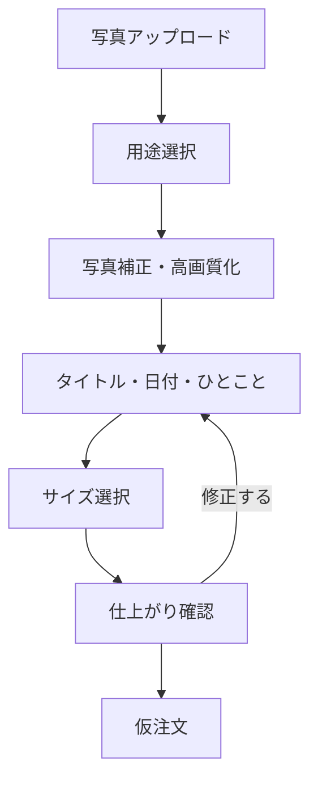
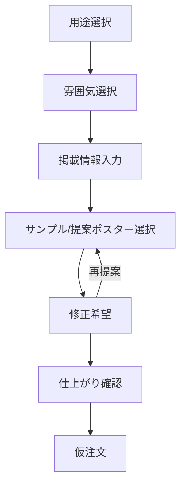
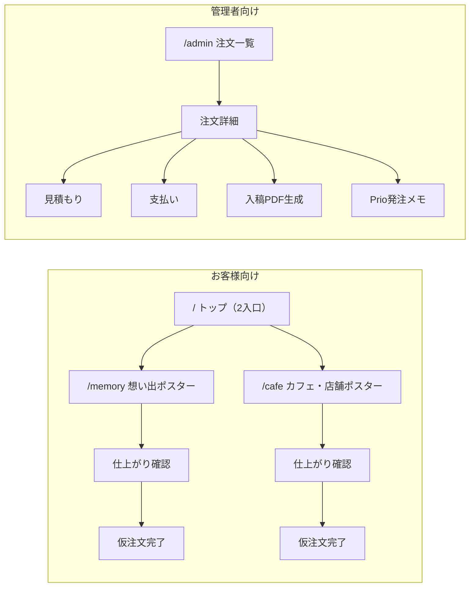

# v1.3 新設計書 — Hana Poster AI 画面再設計

**ステータス**: 設計のみ（未実装）
**ベース**: v1.2-rc2
**対象**: `static/index.html` / `static/app.js` / `main.py` の画面構成

> このドキュメントは設計書であり、実装は含まない。v1.3 の実装に着手する際の起点として使う。

---

## 1. サービスコンセプト

Hana Poster AI を「花屋さん向けの1画面アプリ」から、「想い出ポスター」「カフェ・店舗ポスター」の
2本のウィザード型フローを持つポスター作成サービスへ作り直す。

- お客様は「作る → 確認する → 仮注文する」の3ステップだけを意識すればよい
- 花・ギフト素材は独立カテゴリではなく、カフェ・店舗ポスターの中の一用途として存在する
- 管理業務（見積もり・支払い・入稿・Prio発注）はお客様の目に触れない管理画面に完全分離する

---

## 2. 現行UIの問題点（洗い出し）

| # | 問題 | 現状の該当箇所 |
|---|---|---|
| 1 | 機能が1画面に混在している | `index.html` が花図鑑・AI販促文・ギャラリー・文字入れ・注文履歴・管理操作をすべて1ページに縦積みしている |
| 2 | お客様向けと管理者向けが混ざっている | `#confirmationSection` の「開発用操作」に管理者用PDF/PNG生成が置かれ、`#serverOrdersSection` の管理操作もお客様と同じページ内にスクロールで存在 |
| 3 | PDF保存と仮注文の意味が分かりにくい | 「PNGで保存」「PDFで保存」ボタンと「この内容で仮注文する」ボタンが同じ画面にあり、どちらが注文になるのか都度注記が必要になっている（`order-flow-notice` が複数箇所に重複） |
| 4 | 花素材が前面に出すぎている | ヒーロー直下の作例エリア・ギャラリーが花7カテゴリ（春/夏/秋/冬/母の日/ギフト/開店祝い）中心の構成のまま |
| 5 | 想い出ポスターの導線が弱い | 「自分の画像を使う」アップロードは詳細設定の中に埋もれており（`#advancedSettingsDetails` 内）、高画質化・補正の機能自体が存在しない |
| 6 | カフェ向けのヒアリングがない | `#wishSection`（希望を伝えるフォーム）は用途チップはあるが花・ポスター前提の選択肢のみで、カフェのメニュー・イベント告知などを想定した項目がない |
| 7 | （追加）入口と実フローが分断している | v1.2-rc2 で追加した入口カード（`#entryMemoryCard` / `#entryCafeCard`）はクリック後に既存の汎用編集画面へスクロールするだけで、カテゴリ専用のヒアリングや補正ステップに接続されていない |

---

## 3. 設計方針：お客様向け画面と管理画面の分離

現在は `main.py` の `GET /` が `index.html` 一枚を返し、注文管理UIも同じページ内に同居している。
v1.3 では画面を役割単位で明確に分け、URLレベルでも分離する。

| 領域 | 想定ルート | できること |
|---|---|---|
| お客様向け | `/`（トップ） → `/memory`（想い出フロー） → `/cafe`（カフェ・店舗フロー） | 作る／確認する／仮注文する のみ |
| 管理者向け | `/admin`（注文一覧・詳細） | 注文を見る／見積もり／支払い／入稿PDF生成／Prio発注 |

- お客様向け画面には管理操作（PDF/PNG生成ボタン、見積もり編集、支払いステータス変更など）を一切表示しない
- 管理画面には花図鑑・AI販促文などお客様向け機能を表示しない
- バックエンドAPI（`/api/orders/*` 系）は現状のものをほぼそのまま流用し、フロントのルーティングのみ分離する

---

## 4. 2本の主力フロー

### 4.1 想い出ポスターフロー

**目的**: 写真をアップロードし、写真を整えて、言葉を添えて、印刷用ポスターにする。

| 画面 | 内容 | 現行UIとの対応 |
|---|---|---|
| 写真アップロード | 端末から写真を選択。図鑑参考用画像は不可（権利チェックを継続） | `#officialMaterialInput` を流用。詳細設定の奥から最上段の必須ステップへ格上げ |
| 用途選択 | 家族／ペット／旅行／記念日など、想い出の種類を選択（コピー生成・レイアウト提案のヒントに利用） | 新規。`#wishSection` の chip UI パターンを流用 |
| 写真補正・高画質化 | 明るさ・コントラストの自動補正、必要に応じたアップスケール | **新規機能**（現行に該当なし。v1.3のロードマップで別途スコープ確定が必要） |
| タイトル・日付・ひとこと | メインタイトル・日付・補足文の入力 | `#posterMainTitle` / `#posterDate` / `#posterNote` を流用、店舗名など不要項目は非表示 |
| サイズ選択 | 印刷サイズ（A2/A3/A1）・用紙 | `#printSize` / `#printPaper` を流用 |
| 仕上がり確認 | プレビュー・画質確認・注文前チェック | `#confirmationSection` を流用（管理者向け「開発用操作」は非表示化） |
| 仮注文 | お客様情報入力 → 仮注文保存 | `#customer-info-section` / `/api/save-order` を流用 |

### 4.2 カフェ・店舗ポスターフロー

**目的**: 用途や雰囲気をヒアリングし、提案ポスターを作り、店舗告知用に仕上げる。

| 画面 | 内容 | 現行UIとの対応 |
|---|---|---|
| 用途選択 | 季節メニュー／新作ドリンク／イベント告知／花・ギフト告知 など（花・ギフトはここに選択肢として吸収） | `#wishSection` の `data-group="purpose"` チップを拡張 |
| 雰囲気選択 | やさしい／上品・高級感／ポップ／ナチュラル／和風 など | `#wishSection` の `data-group="mood"` チップを流用 |
| 掲載情報入力 | 店舗名・タイトル・日付・補足文 | `#posterShop` / `#posterMainTitle` / `#posterDate` / `#posterNote` を流用 |
| サンプル/提案ポスター選択 | 花7カテゴリを含む既存ギャラリーを「カフェ・店舗向け素材」として提示し、雰囲気・用途で絞り込み表示 | `#gallerySection`（カテゴリ棚型ギャラリー）を流用・再配置。花・ギフトは独立カードではなくこのギャラリーのタグとして統合 |
| 修正希望 | AIによる文言・レイアウトの再提案 | `#aiRevisionDetails` / `#layoutSuggestButton` を流用 |
| 仕上がり確認 | 想い出フローと共通のコンポーネント | `#confirmationSection` を共有 |
| 仮注文 | 想い出フローと共通 | `/api/save-order` を共有 |

---

## 5. 花・ギフト素材の位置づけ

- 独立カテゴリ・独立入口としては扱わない（v1.2-rc2の方針を踏襲）
- カフェ・店舗ポスターフローの「用途選択」の選択肢の一つ（例：開店祝い／季節の贈りもの）として統合
- 「サンプル/提案ポスター選択」画面では、既存の花7カテゴリ（春/夏/秋/冬/母の日/ギフト/開店祝い）をタグ・フィルタとして提示し、独立セクションとしては表示しない
- `poster_master.csv` のカテゴリ体系（`categories` フィールド）はデータ構造としてはそのまま利用可能。表示側の見せ方のみ変更する

---

## 6. 画面構成（サイトマップ）

- トップ画面は v1.2-rc2 の2入口カード構成をそのまま起点にする
- 各フローはウィザード形式（1画面1テーマ）とし、現行のように全設定を1画面に並べない
- 管理画面はお客様向けページから完全に切り離したルート（`/admin`）に置き、`adminNavButton` によるページ内スクロール遷移は廃止する

---

## 7. 既存機能の再利用方針

以下は管理側・共通基盤としてそのまま残し、フロントの置き場所のみ変更する。

| 機能 | 現行の実装 | v1.3での扱い |
|---|---|---|
| 注文管理 | `/api/orders`, `/api/orders/{id}/json`, `#serverOrdersSection` | `/admin` に移設。API変更なし |
| 見積もり | `/api/orders/{id}/estimate` | `/admin` の注文詳細に移設。API変更なし |
| 支払い管理 | `/api/orders/{id}/payment`, `/api/orders/{id}/status` | `/admin` の注文詳細に移設。API変更なし |
| 入稿PDF生成 | `/api/orders/{id}/pdf`, `/api/orders/{id}/export-info` | `/admin` に移設。お客様向け仕上がり確認画面からは除去 |
| 印刷確認ID | `print_check_id` フィールド、バッジ描画ロジック | 仕組みは変更なし。お客様向けには確認用表示のみ残す |
| Prio発注メモ | `/api/orders/{id}/submission-check`, `print_vendor` 等 | `/admin` に移設。API変更なし |
| A2高解像度出力 | サーバー側の高解像度JPEG/PDF生成ロジック | 変更なし。フロー分割後も両フロー共通で使用 |
| 入稿前チェック | `#orderConfirmChecks`, submission-check | お客様向け「仕上がり確認」に残す（発注前チェックはお客様の同意取得のため） |

---

## 8. 廃止・非表示にするUI

| 対象 | 現状 | 対応 |
|---|---|---|
| 花図鑑セクション（`.catalog-panel` / `.detail-panel`） | トップページ下部に常設 | お客様向けフローから外す。花・ギフト用途選択時の参考情報として、必要なら管理画面または別ページに退避を検討（本設計書では対象外・別途判断） |
| AI販促文作成（`#promotionSection`） | トップページ下部に常設 | 花図鑑と同様に主要フローから外す。カフェ・店舗フローの「修正希望」機能に統合できないか別途検討 |
| 希望を伝えるフォーム（`#wishSection`） | 独立セクションとしてトップに常設 | 独立セクションとしては廃止し、カフェ・店舗フローの「用途選択」「雰囲気選択」画面に吸収 |
| 作例エリア（`#showroomSection`） | 花中心の4カード、トップに常設 | 独立トップセクションとしては廃止し、カフェ・店舗フローの「サンプル/提案ポスター選択」に統合 |
| ポスターギャラリー（`#gallerySection`） | 花7カテゴリ棚、トップに常設 | トップからは外し、カフェ・店舗フロー内のサンプル選択画面に移動 |
| ポスター文字入れ1画面設計（`#posterSection` 全体） | 文字入れ・印刷設定・お客様情報が1画面に混在 | 想い出／カフェ・店舗それぞれのウィザードへ分割。1画面には残さない |
| 仕上がり確認内の「開発用操作」（`.order-dev-actions`） | お客様向け画面に管理者用PDF/PNG生成ボタンが表示されている | お客様向けからは完全に削除し、`/admin` の注文詳細のみに残す |
| 管理者向けセクション群（`#serverOrdersSection` 内の警告バナー・同期ボタン等） | お客様向けページと同一ページ内 | `/admin` へ完全移設 |
| `adminNavButton`（「注文状況を確認する」） | お客様向けヘッダーからページ内スクロールで管理エリアへ遷移 | `/admin` への別ルート遷移に置き換え、または撤去 |

---

## 9. v1.3 実装ロードマップ（案）

| フェーズ | 内容 |
|---|---|
| v1.3-rc1 | ルーティング分離の骨格作り。`main.py` に `/memory` `/cafe` `/admin` を追加し、既存 `index.html` から機能を壊さない範囲でページを分割。既存の `/api/*` は無変更 |
| v1.3-rc2 | 想い出ポスターフローのウィザードUI実装（写真補正・高画質化を除く、既存流用パーツの組み替えのみ） |
| v1.3-rc3 | カフェ・店舗ポスターフローのウィザードUI実装（花・ギフト用途の統合、既存ギャラリーの再配置） |
| v1.3-rc4 | 管理画面（`/admin`）の独立実装。見積もり・支払い・入稿PDF・Prio発注メモを移設し、お客様向け画面から管理操作を完全撤去 |
| v1.3-rc5 | 旧UI要素（花図鑑・AI販促文・希望フォーム単独セクション等）の撤去、回帰確認、リリースノート整備 |
| 未確定・別途スコープ化 | 写真補正・高画質化のアルゴリズム選定（サーバー側処理か外部API連携か） |

各フェーズの実装着手前に、対象フェーズのみのタスク分解・確認を別途行う。

---

## 10. 非対象・保留事項

- 写真の「高画質化・補正」の具体的な実装方式（アルゴリズム／外部API利用の有無）は本設計書では決定しない
- 花図鑑・AI販促文セクションの完全撤去 vs 別ページ化は本設計書では結論を出さず、v1.3-rc5着手前に別途判断する
- `poster_master.csv` のカテゴリ体系自体の再設計（データ構造の変更）は本設計書のスコープ外
